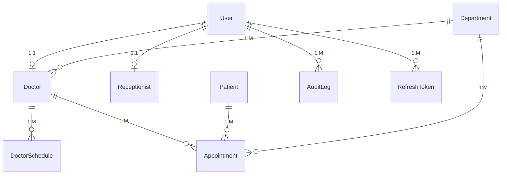

# Database Schema & Diagram

The Enterprise EMR uses MongoDB as its primary datastore, leveraging Mongoose for schema definition. The schema is designed for read-heavy operations, utilizing embedding where appropriate and referencing for independent collections to avoid excessive `$lookup` joins.

## Entity-Relationship Diagram

## Schema Definitions

### 1. User
Core authentication and identity collection.
- `_id`: ObjectId
- `firstName`: String
- `lastName`: String
- `email`: String (Unique)
- `password`: String (Hashed)
- `role`: Enum (`SUPER_ADMIN`, `RECEPTIONIST`, `DOCTOR`)
- `isActive`: Boolean

### 2. Doctor
Clinical profile extending a User.
- `_id`: ObjectId
- `user`: ObjectId (Ref: User)
- `department`: ObjectId (Ref: Department)
- `specialization`: String
- `consultationFee`: Number

### 3. Patient
Patient demographic and contact data.
- `_id`: ObjectId
- `patientId`: String (Unique, Auto-generated)
- `firstName`: String
- `lastName`: String
- `dob`: Date
- `gender`: Enum (`Male`, `Female`, `Other`)
- `mobile`: String (Indexed)
- `email`: String
- `primaryContactName`: String (Emergency Contact)
- `primaryContactNumber`: String
- `relationship`: String

### 4. Appointment
The core transactional entity linking patients and doctors.
- `_id`: ObjectId
- `patient`: ObjectId (Ref: Patient)
- `doctor`: ObjectId (Ref: Doctor)
- `department`: ObjectId (Ref: Department)
- `appointmentDate`: String (YYYY-MM-DD)
- `slotTime`: String (HH:mm)
- `status`: Enum (`Scheduled`, `Arrived`, `Completed`, `Cancelled`)
- `purpose`: String
- `notes`: String

**Indexes**: 
- Compound Unique Index on `{ doctor: 1, appointmentDate: 1, slotTime: 1 }` with a partial filter (`status: { $ne: 'Cancelled' }`) to strictly prevent double-booking at the database level.

### 5. DoctorSchedule
Defines when a doctor is available for appointments.
- `_id`: ObjectId
- `doctor`: ObjectId (Ref: Doctor)
- `workingDays`: Array of Strings (e.g., `["Monday", "Tuesday"]`)
- `sessions`: Array of Objects `{ startTime: "09:00", endTime: "13:00" }`
- `slotDuration`: Number (e.g., 15 minutes)

### 6. AuditLog
Immutable ledger of critical system actions.
- `_id`: ObjectId
- `user`: ObjectId (Ref: User)
- `role`: Enum
- `action`: String (e.g., `LOGIN`, `CREATE_APPOINTMENT`)
- `entity`: String
- `entityId`: ObjectId

### 7. RefreshToken
Manages session security.
- `_id`: ObjectId
- `user`: ObjectId (Ref: User)
- `token`: String
- `expiresAt`: Date
**Indexes**: TTL (Time-To-Live) index on `expiresAt` for automatic cleanup of expired sessions by MongoDB.
