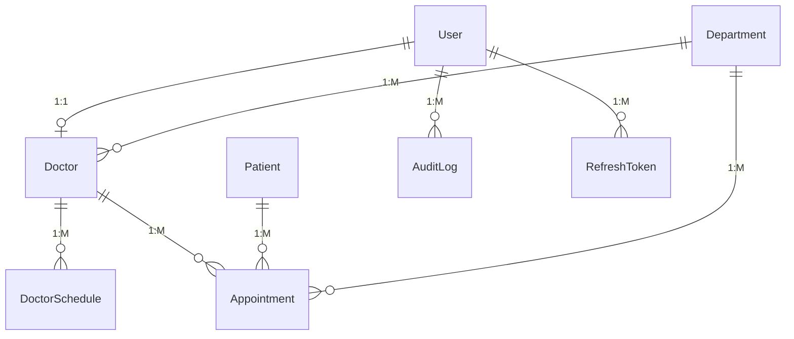

# Enterprise EMR Appointment Management System

This is a production-ready, security-hardened EMR Appointment Management platform built on the MERN Stack (MongoDB, Express, React, Node.js) with role-based dashboard control.

---

## Folder Structure

```
├── client/                     # React + Vite Client
│   ├── src/
│   │   ├── components/         # Shared UI components
│   │   ├── context/            # AuthContext session provider
│   │   ├── layouts/            # Dashboard role-based layout
│   │   ├── pages/              # Login & Dashboard sub-pages
│   │   ├── services/           # Axios client & modular API requests
│   │   ├── types/              # Type interfaces
│   │   ├── App.tsx             # Routing & guards
│   │   └── main.tsx            # App mount
│   ├── .env                    # Client environment settings
│   └── package.json
│
└── server/                     # Express Backend
    ├── src/
    │   ├── config/             # DB & env configs
    │   ├── constants/          # Role and status enums
    │   ├── controllers/        # Request handlers
    │   ├── middlewares/        # Auth & RBAC validation
    │   ├── models/             # Mongoose schemas & indexes
    │   ├── routes/             # Route configurations
    │   ├── services/           # Business logic & workflows
    │   ├── utils/              # Token generators & helpers
    │   └── validators/         # Zod payload schemas
    ├── .env                    # Server environment settings
    └── package.json
```

---

## Installation & Setup

### Prerequisites
- Node.js (v18+)
- MongoDB running locally on `mongodb://127.0.0.1:27017`

### 1. Backend Setup
1. Navigate to the server folder:
   ```bash
   cd server
   ```
2. Install dependencies:
   ```bash
   npm install
   ```
3. Set up the `.env` file (already configured for this workspace):
   ```env
   PORT=5000
   MONGO_URI=mongodb://127.0.0.1:27017/emr
   JWT_ACCESS_SECRET=your_access_secret
   JWT_REFRESH_SECRET=your_refresh_secret
   ```
4. Run the database seed script to create the Super Admin account:
   ```bash
   npm run seed
   ```
5. Start the backend development server:
   ```bash
   npm run dev
   ```

### 2. Frontend Setup
1. Navigate to the client folder:
   ```bash
   cd client
   ```
2. Install dependencies:
   ```bash
   npm install
   ```
3. Set up the `.env` file (already configured for this workspace):
   ```env
   VITE_API_URL=http://localhost:5000/api/v1
   ```
4. Start the Vite dev server:
   ```bash
   npm run dev
   ```
5. Open your browser and navigate to `http://localhost:5173`.

---

## Authentication Credentials

Use the seeded Super Admin credentials to log in and set up clinical staff (Doctors, Receptionists) and configure schedules:

- **Email**: `admin@hospital.com`
- **Password**: `Admin@123`

### Operational Workflow
1. **Log in as Super Admin**:
   - Register new doctors and receptionists.
   - Go to the **Schedules** tab, select a doctor, and click **Save Schedule** (e.g. choose days, slots, and time frames) to configure working times.
2. **Log in as Receptionist** (e.g., using the credentials you created under the Admin dashboard):
   - Search existing patients, or register new patients (supports dynamic emergency contact fields).
   - Go to the **Scheduler** tab, select a doctor and date, click a generated time slot, pick a patient, and click **Confirm Appointment**.
   - Go to the **Appointment Flow** tab to check in patients (Arrived), check them out (Completed), or cancel.
3. **Log in as Doctor**:
   - View your own assigned consultations and times.
   - Edit consultation notes/purpose of visit dynamically.

---

## Architecture Overview

The application follows a **layered, modular monolithic architecture** using the MERN stack:
- **Client (React + Vite)**: Uses Context API for global auth state, Axios for API calls with token interceptors, and React Router for role-based protected routes (`SUPER_ADMIN`, `RECEPTIONIST`, `DOCTOR`). Tailwind CSS is used for UI styling.
- **Server (Express + Node.js)**: Implements a Controller-Service-Repository-Model pattern. Business logic resides in `services/`, input validation in `validators/` (using Zod), and data access in `models/` (Mongoose).
- **Authentication**: JWT-based with short-lived access tokens (15m) and HTTP-only refresh tokens (7d) for secure, seamless session management.

---

## Database Design

The database is designed for fast reads and writes, avoiding expensive `$lookup` joins where possible.

### Collections:
- **User**: Core identities (admin, doctors, receptionists) with role and credentials.
- **Doctor**: Clinical profile (specialization, fee) linked to a `User` and `Department`.
- **Department**: Hospital departments (e.g., Cardiology).
- **Patient**: Patient demographics and contact information.
- **DoctorSchedule**: Configuration of a doctor's working days, sessions, and slot duration.
- **Appointment**: The core transactional entity linking `Patient`, `Doctor`, and `Department`.
- **RefreshToken**: Active refresh tokens with TTL indexes.
- **AuditLog**: Immutable ledger tracking system actions (Logins, Appointment CRUD).

### Entity-Relationship Diagram


---

## API Documentation

### Authentication
- `POST /api/v1/auth/login` - Authenticate user and return tokens
- `POST /api/v1/auth/logout` - Invalidate refresh token
- `POST /api/v1/auth/refresh` - Get new access token using refresh token cookie

### Appointments
- `GET /api/v1/appointments` - List appointments (supports filtering/pagination)
- `POST /api/v1/appointments` - Book a new appointment
- `PUT /api/v1/appointments/:id` - Update appointment details (purpose/notes)
- `PATCH /api/v1/appointments/:id/status` - Change appointment status
- `DELETE /api/v1/appointments/:id` - Cancel/soft-delete an appointment
- `POST /api/v1/appointments/:id/arrive` - Mark a patient as arrived
- `GET /api/v1/appointments/available-slots` - Get available slots for a doctor/date

*(Additional CRUD endpoints exist for Doctors, Patients, Schedules, Departments, and Receptionists).*

---

## Environment Variables

### Backend (`server/.env`)
```env
PORT=5000
MONGO_URI=mongodb://127.0.0.1:27017/emr
JWT_ACCESS_SECRET=your_access_secret_key
JWT_REFRESH_SECRET=your_refresh_secret_key
```

### Frontend (`client/.env`)
```env
VITE_API_URL=http://localhost:5000/api/v1
```

---

## Assumptions Made

1. **Breaks & Sessions**: Doctor breaks are implicitly defined as the gaps between `sessions` in their schedule. Slots are only generated within defined session blocks.
2. **Cancellation Flow**: Deleting an appointment soft-deletes it by changing its status to `CANCELLED` rather than removing the record, to preserve medical history and audit trails.
3. **Timezones**: The system assumes the client and server are operating in the same timezone (local clinic timezone).

---

## Known Limitations

1. **WebSockets**: Real-time Socket.IO updates for the Scheduler are not currently implemented.
2. **Concurrency**: While MongoDB unique indexes prevent double-booking at the database level, high-concurrency environments might experience unhandled rejection spikes without a message broker queue.

---

## Future Improvements

1. **Real-Time Updates**: Implement Socket.IO to push live slot availability updates to all connected receptionists.
2. **Caching Layer**: Integrate Redis to cache available slots and doctor schedules, drastically reducing MongoDB read load.
3. **Queue System**: Implement RabbitMQ for processing appointment bookings to handle high throughput during peak hours.
